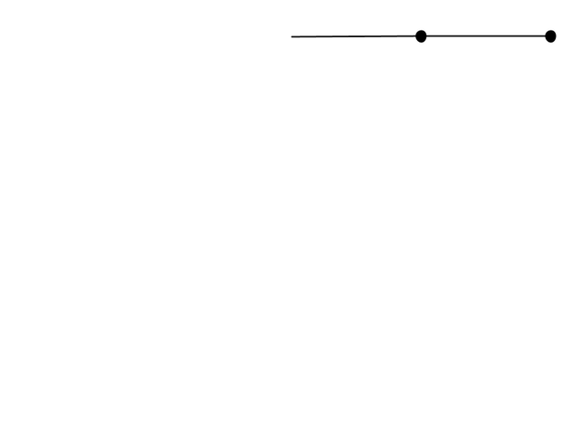

# Hello there...

💻 Fullstack Developer with a focus on Front-end 

🚀 Passionate about building scalable interfaces and design systems

---

## 📚 BGSR - Biodiversity and Geoscience Spatial Registry

[BGSR](https://bgsr.gabrielkuran42.workers.dev/?scenario=default) is an open-source, map-first scientific platform for exploring biodiversity and geoscience in the same spatial context. It integrates fauna, flora, soil, and geological layers into a single interface built for regional analysis, environmental interpretation, and field-oriented research.

  

---

## 📚 boulder-ui / Storybook

A geology-inspired React UI kit focused on accessible, scalable, and consistent interfaces using nature-toned primitives and design system principles.

  

---

## ⚙️ Double Pendulum

A nonlinear dynamics [simulation](https://github.com/Gkuran/art-or-something/blob/main/penduloDuplo.pde) demonstrating chaotic motion through classical mechanics and Hamiltonian formalism.

  

### Hamiltonian Formulation

The Hamiltonian is given by

$$
H(q_1,q_2,p_1,p_2)=T(q_1,q_2,p_1,p_2)+V(q_1,q_2)
$$

with generalized coordinates:

$$
q_1=\theta_1,\qquad q_2=\theta_2
$$

Canonical equations:

$$
\dot q_i = \frac{\partial H}{\partial p_i},
\qquad
\dot p_i = -\frac{\partial H}{\partial q_i}
$$
